# nemo-stock E2E 테스트 보고서

- **일시**: 2026-07-14
- **대상**: `backend`(FastAPI, `:8000`) + `frontend`(Vite dev server, `:5173`) 동시 기동 상태의 실제 애플리케이션
- **도구**: Playwright(headless Chromium)로 실제 브라우저를 구동해 클릭/드래그/입력을 수행하고 각 단계마다 전체 화면 스크린샷을 캡처
- **범위**: 로그인 → 대시보드 → 전략 빌더(노드 추가/연결/저장/검증) → 테스트 실행(디버그 하이라이트) → AI 전략 생성 → 백테스트 폼 → 대시보드 반영까지 골든 패스 전 구간
- **결과**: **12/12 스텝 PASS**, 콘솔 런타임 에러 0건 (테스트 중 발생한 유일한 콘솔 로그는 AI 전략 생성 시 `OPENAI_API_KEY` 미설정으로 인한 예상된 400 응답)

## 요약

| # | 스텝 | 결과 | 비고 |
| --- | --- | --- | --- |
| 1 | 로그인 화면 렌더링 | ✅ PASS | |
| 2 | 로그인 → 대시보드 진입 | ✅ PASS | |
| 3 | 전략 빌더 캔버스 로드 | ✅ PASS | 기본 스케줄러 노드 자동 배치 |
| 4 | 팔레트에서 노드 3개 추가 | ✅ PASS | 캔버스 노드 수 4개 확인 |
| 5 | 노드 핸들 드래그로 연결 | ✅ PASS (버그 수정 후) | 엣지 3/3 연결 — 최초 발견 시 실패, 아래 "발견된 이슈" 참조 |
| 6 | 전략 저장 | ✅ PASS | `/strategies/{id}`로 URL 갱신 확인 |
| 7 | 그래프 검증 | ✅ PASS | "✔ 유효한 워크플로입니다." |
| 8 | 테스트 실행 + 디버그 하이라이트 애니메이션 | ✅ PASS | 노드 4개 × running/success 이벤트 8건 |
| 9 | 디버그 상세(입출력 JSON) 표시 | ✅ PASS | |
| 10 | AI 전략 생성 화면 | ✅ PASS | 키 미설정 시 400 오류 정상 처리 |
| 11 | 백테스트 실행 폼 렌더링 | ✅ PASS | |
| 12 | 대시보드에 저장된 전략 표시 | ✅ PASS | |

## 발견된 이슈와 수정

### [수정 완료] 노드를 연속으로 추가하면 새 노드가 우측 패널 아래로 가려져 연결이 불가능함

- **증상**: 전략 빌더에서 노드를 3개 이상 연속으로 빠르게 추가한 뒤 마지막 노드를 다른 노드와 연결하려 하면, 해당 노드의 핸들이 우측 속성/검증/디버그 패널(`side-panel`, `width: 300px`) 아래에 깔려 마우스 이벤트가 패널에 가로채였다(Playwright 로그: `<div class="tab-content"> ... subtree intercepts pointer events`).
- **원인**: 노드 추가 시 캔버스를 자동으로 맞춰주는 `fitView()`가 `nextTick()` 직후 바로 호출되고 있었는데, Vue Flow가 새로 추가된 노드의 실제 크기를 `ResizeObserver`로 측정하기 전이라 `fitView()`가 부정확한(측정 전) 크기 기준으로 확대/축소·이동을 계산했다. 그 결과 최신 노드가 캔버스 가시 영역 밖, 즉 우측 패널 뒤로 배치되는 경우가 있었다.
- **재현**: 스케줄러(기본) + 시세 데이터 조회 + IF 조건 + 시장가 주문, 총 4개 노드를 순서대로 추가한 뒤 핸들 드래그로 연결 시도 → 마지막(4번째) 노드만 연결 실패, 검증 패널에 "스케줄러로부터 도달할 수 없는 노드입니다" 오류 표시.
- **수정**: `frontend/src/views/StrategyBuilderView.vue`의 `fitView` 호출을 `nextTick()` 이후 `requestAnimationFrame`을 두 번 거쳐 노드 크기 측정이 완료된 뒤 실행하도록 변경(`scheduleFitView()` 함수로 분리, 노드 추가·워크플로 로드·AI 초안 로드 세 경로 모두에 적용).
- **재검증**: 동일 시나리오 재실행 결과 4개 노드 모두 정상 가시 범위에 배치되고, 3개 엣지 전부 정상 연결됨(아래 스크린샷 05번 참조). 이후 회귀 없음.
- **영향도**: PoC 단계에서는 노드 3~4개 이상을 빠르게 추가하는 경우에만 발생하는 프론트엔드 전용 UI 버그였으며, 백엔드 로직/데이터에는 영향 없음. 이번 E2E 테스트 과정에서 실사용 흐름과 동일한 방식(팔레트 클릭 → 즉시 연결)으로 조작했기 때문에 발견할 수 있었다.

## 스크린샷

### 1. 로그인 화면
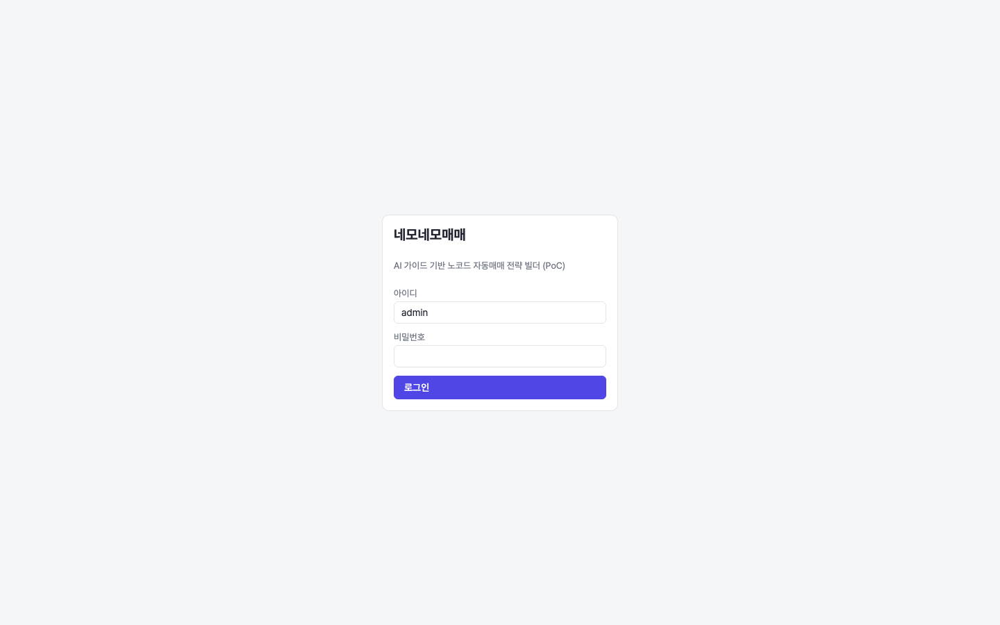

### 2. 로그인 직후 대시보드 (빈 상태)
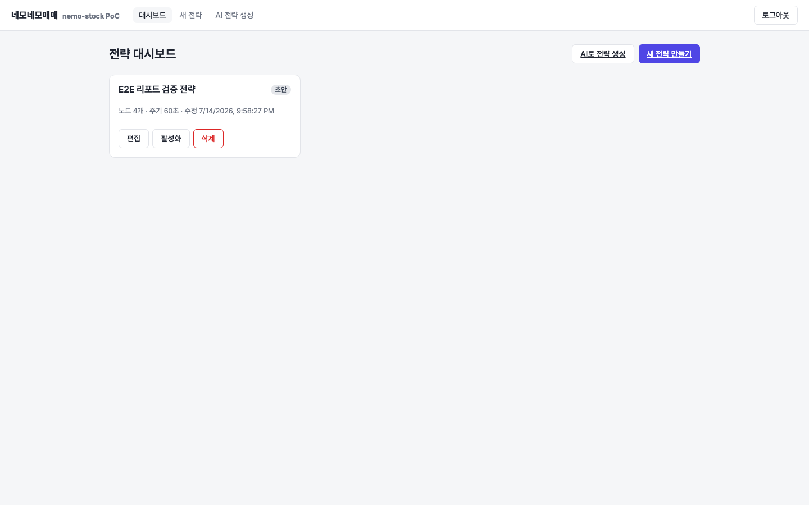

### 3. 전략 빌더 초기 화면 (기본 스케줄러 노드)
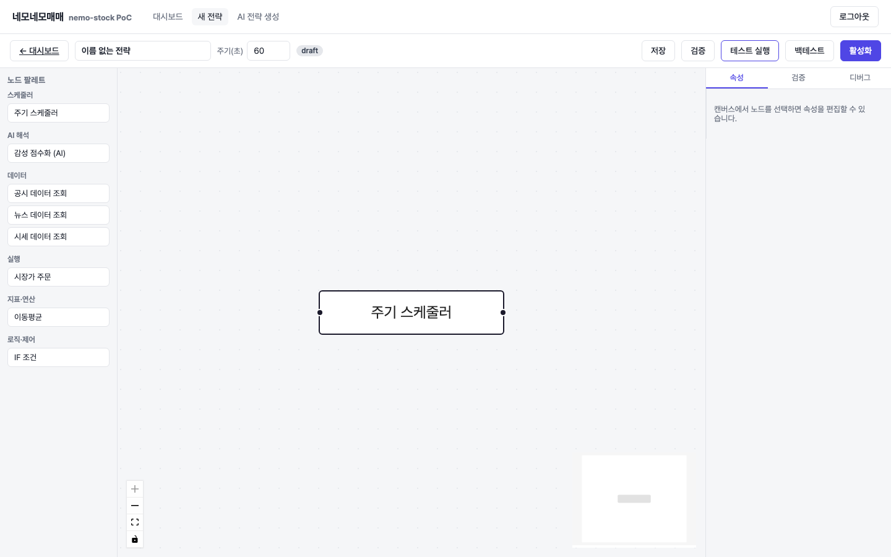

### 4. 노드 팔레트에서 3개 노드 추가 직후
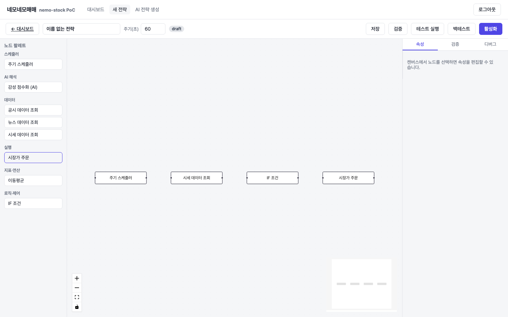

### 5. 핸들 드래그로 4개 노드 전체 연결 (버그 수정 후)
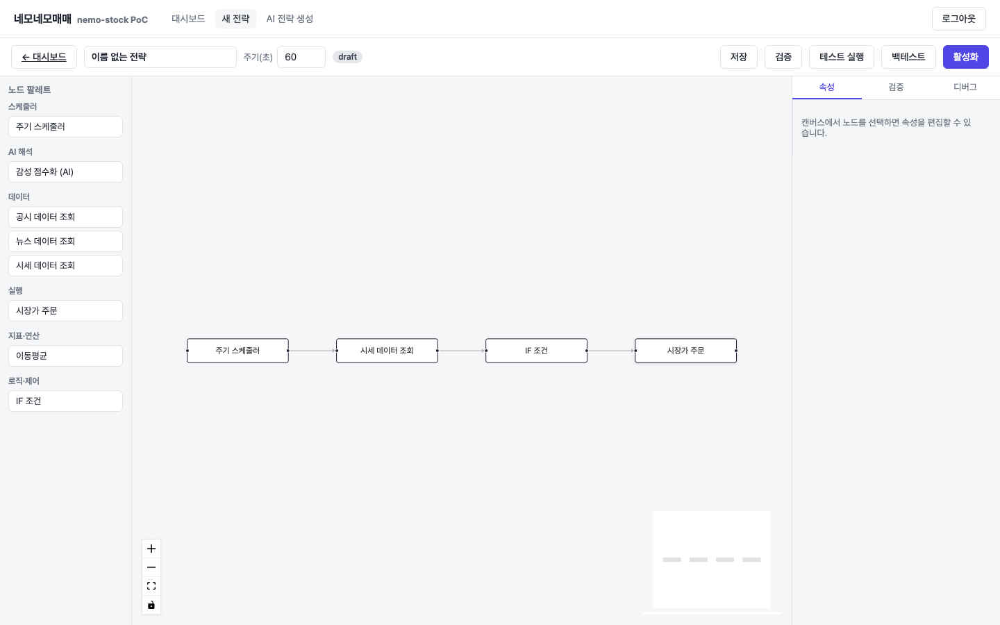

### 6. 전략 저장 완료
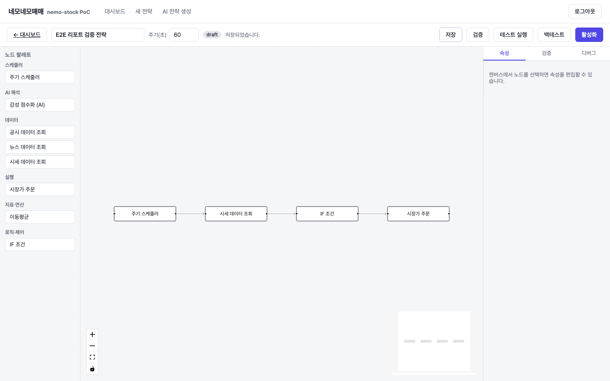

### 7. 그래프 검증 — 유효한 워크플로 확인
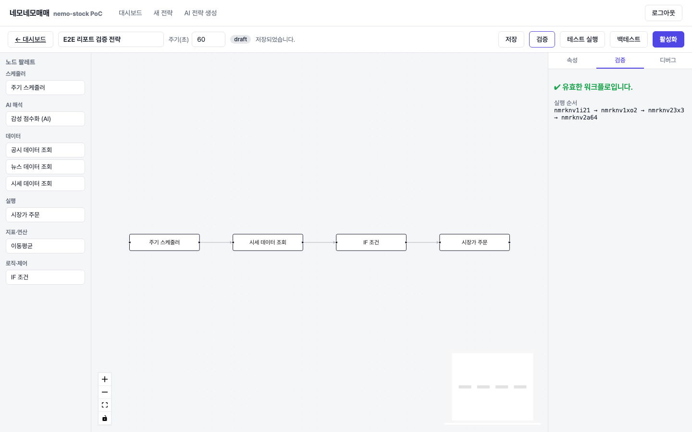

### 8. 테스트 실행 모달
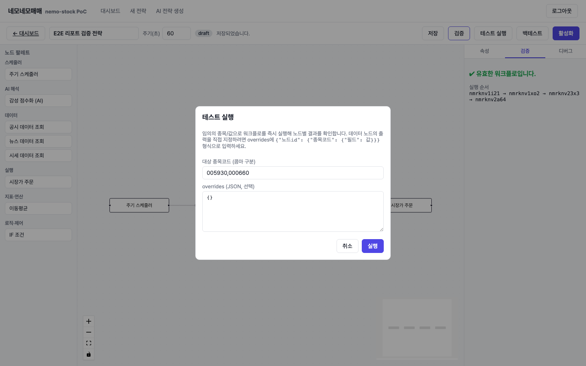

### 9. 테스트 실행 중 — 노드 하이라이트(노란 펄스) 애니메이션
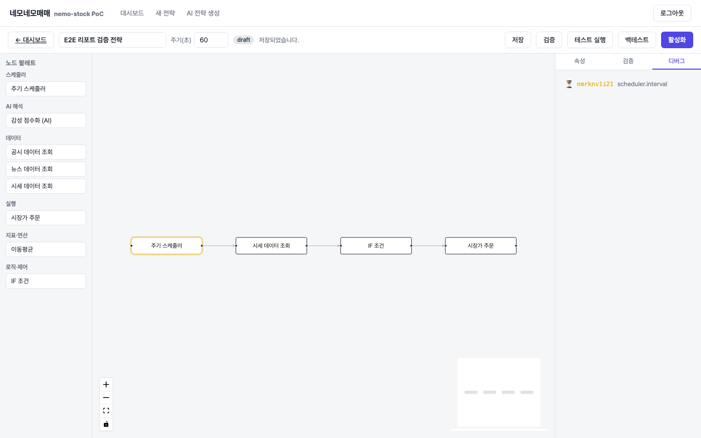

### 10. 테스트 실행 완료 — 전체 노드 초록 하이라이트 + 디버그 이벤트 로그
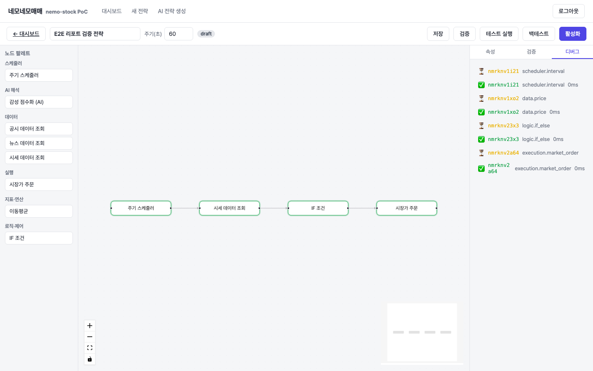

### 11. 디버그 상세 — 노드 입출력 JSON
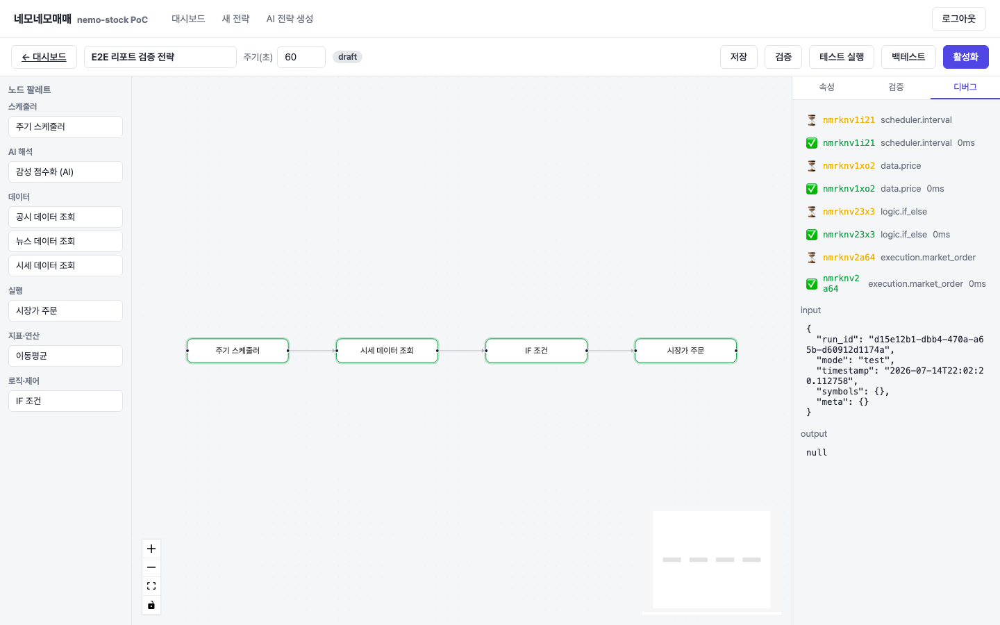

### 12. AI 전략 생성 화면 — API 키 미설정 오류 정상 처리
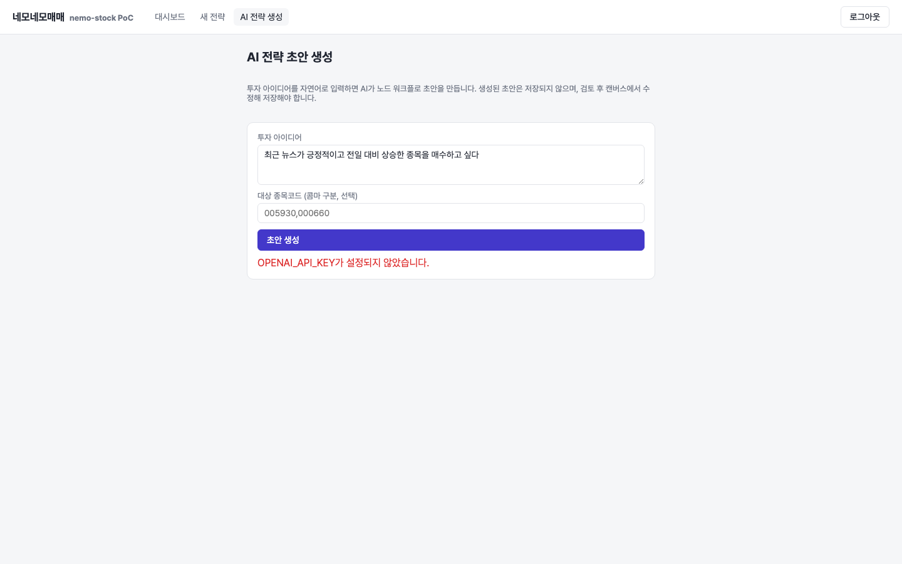

### 13. 백테스트 실행 폼
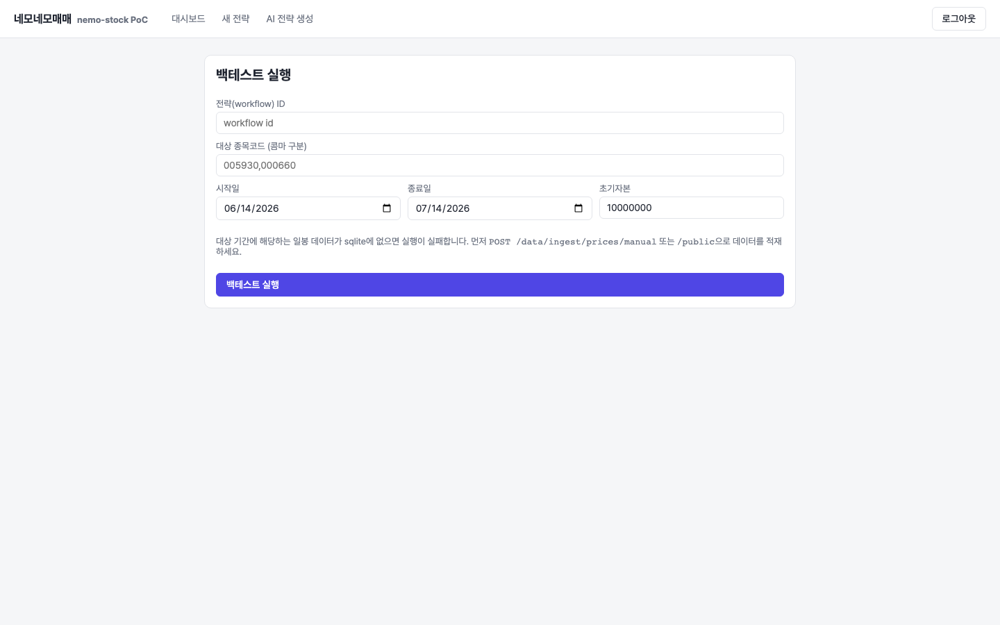

### 14. 대시보드 — 저장된 전략 반영 확인
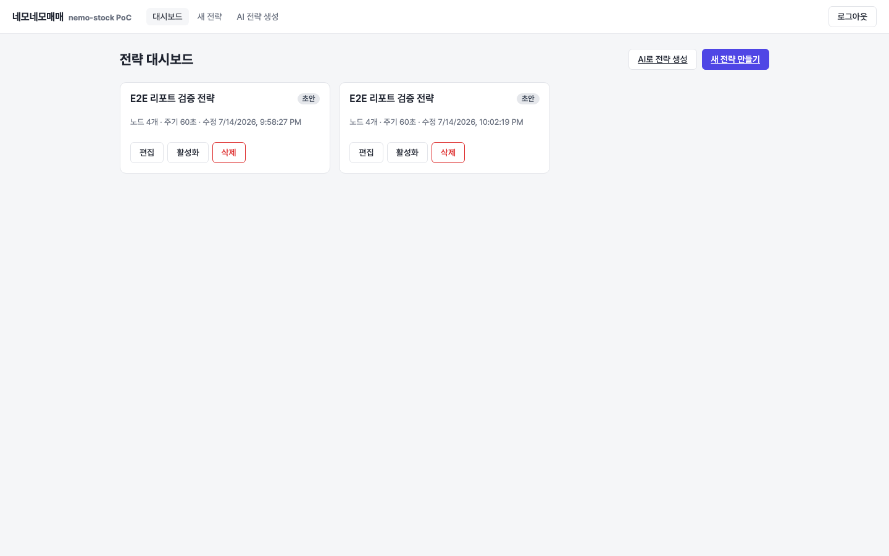

## 실행 환경

```
backend:  ./.venv/bin/uvicorn app.main:app --port 8000   (SQLite: 임시 nemo_stock.db)
frontend: npm run dev                                     (Vite, :5173)
브라우저:  Playwright chromium (headless), viewport 1440x900
계정:     admin / admin1234
```

## 참고

- 이 테스트는 `docs/e2e/` 경로에 스크립트를 남기지 않는 방식(세션 스크래치 디렉토리에서 실행)으로 수행했으며, 결과물인 스크린샷과 본 보고서만 저장소에 포함했다.
- AI 전략 생성 단계는 `OPENAI_API_KEY`가 설정되지 않은 환경에서 실행되어 정상적으로 400 오류를 반환하는 것을 확인했다(키가 설정된 환경에서의 실제 생성 동작은 `backend/tests/unit/test_workflow_draft.py`의 `FakeAIClient` 기반 유닛 테스트로 별도 검증되어 있음).
- 발견된 버그 수정 사항(`frontend/src/views/StrategyBuilderView.vue`)은 이 보고서 작성과 함께 반영되었으며, 별도 커밋으로 저장 예정.
