# nemo-stock E2E 테스트 보고서 #2 — 노드 인라인 편집 + 실키 연동 + 실데이터 백테스트

- **일시**: 2026-07-15
- **이전 보고서**: `../2026-07-14-golden-path/report.md` (최초 골든 패스 검증)
- **이번 범위**: (1) 신규 기능 — 노드 캔버스 인라인 파라미터 편집 + 속성 패널 코드(JSON) 모드,
  (2) 실제 발급받은 OpenAI / 공공데이터포털 / OpenDART 키로 실동작 검증, (3) KOSCOM CHECK-API
  실시세 어댑터 스켈레톤 추가, (4) 삼성전자·SK하이닉스 2종목·2026년 3~6월 실데이터로 백테스트 실행
- **결과 요약**: 신규 UI 기능 정상 동작 확인, **테스트 과정에서 실제 버그 2건 발견 및 수정**
  (아래 "발견된 이슈" 참조), 수정 후 전체 골든 패스 재검증 통과, 백엔드 테스트 80개 전부 통과

## 배경: 시크릿 관리 이슈 (선행 조치)

작업 시작 시점에 `backend/.env.example`(git에 커밋되는 템플릿 파일)에 실제 OpenAI 키가
평문으로 들어가 있는 것을 발견했다. 이 파일은 `.gitignore`에 걸리지 않아 그대로 두면 저장소에
실제 키가 노출될 상황이었다. 다음과 같이 조치했다:

- 실제 키(OpenAI/공공데이터포털/OpenDART)를 `backend/.env`(gitignore 처리됨, 커밋 안 됨)로 이동.
- `backend/.env.example`은 빈 값 템플릿으로 원복.
- 공공데이터포털 서비스키는 "URL Encoding" 형태로 전달받았는데, httpx가 요청 시 자동으로
  다시 인코딩하므로 그대로 넣으면 이중 인코딩되어 인증이 실패한다는 것을 확인하고 디코딩된
  원본 값으로 `.env`에 저장(`app/config.py`/`.env.example`에 주석으로 명시).
- 테스트 격리 보강: `tests/conftest.py`의 `app_client` 픽스처가 `OPENAI_API_KEY` 등 키 관련
  설정을 명시적으로 빈 문자열로 오버라이드하도록 수정. 로컬 `.env`에 실제 키가 있으면
  "키 미설정" 경로를 검증하는 테스트가 실제 키를 읽어버려 오탐/누락이 생길 수 있었음
  (실제로 이 문제로 테스트 3개가 일시적으로 실패했다가 수정 후 재통과).

## 신규 기능: 노드 인라인 편집 + 코드 모드

기존에는 캔버스에 노드 이름만 표시되고 파라미터는 우측 속성 패널에서만 편집할 수 있었다.
요청에 따라 다음을 구현했다:

1. **캔버스 노드 안에 파라미터 인라인 표시 + 마우스 편집**: `ParamFields.vue` 컴포넌트를
   속성 패널과 캔버스 커스텀 노드(`#node-workflow` 슬롯, `StrategyBuilderView.vue`)가 공유하도록
   분리. select/checkbox/number/text/expression 타입별로 드롭다운·체크박스·입력창을 노드 박스
   안에 직접 렌더링하고, `nodrag nopan` 클래스로 Vue Flow의 드래그/팬 제스처와 충돌하지 않게 처리.
2. **IF 조건이 그래프에서 직접 보임**: `logic.if_else`의 `expr`(expression 타입) 파라미터는
   모노스페이스 폰트 + 강조 배경으로 노드 안에 표시되어, 캔버스만 봐도 "무슨 조건으로 분기하는지"
   바로 확인할 수 있다(스크린샷 03번).
3. **속성 패널 코드(JSON) 모드**: 노드를 선택하면 "폼"/"코드(JSON)" 탭으로 전환 가능. 코드
   모드에서는 해당 노드의 params를 JSON으로 직접 편집하고 "적용"하면 폼/캔버스에 즉시 반영된다
   (스크린샷 05번, 12번).

### [발견 및 수정] 노드를 여러 개 빠르게 추가하면 fitView가 새 노드를 우측 패널 아래로 가림

파라미터가 인라인으로 표시되면서 노드 박스가 커졌고, 이 상태에서 재현했다. 원인과 수정은
이전 보고서(`2026-07-14-golden-path/report.md`)에 기록된 것과 동일한 근본 원인
(`fitView()`가 Vue Flow의 노드 크기 측정 완료 전에 호출됨)이며, 이번에는 노드가 더 커져서
문제가 더 쉽게 재현되었다. 이미 적용된 `scheduleFitView()`(requestAnimationFrame 2회 지연)
수정으로 이번에도 정상 동작함을 재확인했다(스크린샷 02, 04번 — 4개 노드 전부 화면 안에
보이고 3개 엣지 모두 정상 연결).

## [발견 및 수정] 실키 연동 중 발견한 백엔드 버그 2건

### 버그 1: 공공데이터포털 시세 API의 `srtnCd`(종목코드 정확일치) 파라미터가 서버에서 무시됨

- **증상**: `POST /data/ingest/prices/public`에 종목코드 `005930`, 10일 구간을 요청했는데
  `{"ingested": 17263}` 응답. 실제 DB에는 종목 필터링 덕분에 6건만 저장되어 눈치채기 쉬웠지만,
  만약 필터링 로직이 없었다면 **삼성전자 요청인데 완전히 다른 종목(예: KOSDAQ의 "딥커머스",
  "코스피의 동화약품" 등) 데이터가 005930이라는 잘못된 라벨로 DB에 저장될 뻔한 심각한 데이터
  무결성 버그**였다.
- **원인 확인**: `srtnCd=005930`로 직접 curl 호출한 결과 `totalCount: 17263`이고 응답 항목이
  전혀 다른 종목들(900110, 900270, 000020...)로 섞여 나옴 — 서버가 `srtnCd` 파라미터를 사실상
  무시하고 시장 전체 데이터를 반환하는 것을 확인. `likeSrtnCd`(부분일치) 파라미터로 바꿔서
  같은 요청을 하니 `totalCount: 6`, 정확히 삼성전자 데이터만 반환됨을 확인.
- **수정** (`app/data_ingestion/public_data_price.py`):
  1. 요청 파라미터를 `srtnCd` → `likeSrtnCd`로 변경(6자리 고정폭 코드라 부분일치도 사실상
     정확일치와 동일하게 동작).
  2. 서버가 다시 필터를 무시하는 경우에 대비해 응답에서도 `srtnCd`가 요청한 종목코드와
     실제로 일치하는 행만 클라이언트에서 한 번 더 걸러내도록 방어 코드 추가.
  3. 페이지네이션 진행 여부 판단은 필터링 전(all_rows/total_count) 기준으로 하도록 분리
     (필터링된 목록만 보고 "이 페이지엔 없음"으로 조기 종료하면 뒷페이지의 진짜 데이터를
     놓치는 2차 버그가 될 뻔한 것을 구현 중 자체 발견해 함께 수정).
  4. 안전장치로 `max_pages=50` 상한 추가(서버가 필터를 다시 무시하는 최악의 경우에도 시장
     전체를 끝까지 순회하지 않도록).
  5. 회귀 테스트 추가: 서버가 다른 종목이 섞인 응답을 주더라도 클라이언트가 요청한 종목만
     정확히 걸러내는지 검증(`test_fetch_daily_prices_filters_out_mismatched_symbols_from_server`).
- **재검증**: 삼성전자/SK하이닉스 각각 2026-03-01~06-30(약 4개월, 실제 거래일 81일) 조회 →
  각 81건 정확히 적재됨, DB에 두 종목만 정확히 존재함을 직접 확인.

### 버그 2: OpenDART 공시 조회가 특정 종목 필터링 시 사실상 끝나지 않을 수 있음

- **증상**: `POST /data/ingest/disclosures/public`에 10일 구간 + 종목 2개를 요청했는데 500 에러
  (`httpx.ReadTimeout`).
- **원인**: OpenDART `list.json`은 `corp_code`를 지정하지 않으면 시장 전체 공시를 반환한다.
  10일 구간에도 총 6,920건/2,307페이지에 달했다(실측). 우리 클라이언트는 종목코드를 클라이언트
  측에서 필터링하는 구조(Phase 3 설계 당시의 의도된 단순화)라 전체 페이지를 끝까지 순회해야
  했고, 이는 사실상 수십 분 이상 걸려 타임아웃으로 이어졌다.
- **수정** (`app/data_ingestion/opendart_client.py`): `fetch_disclosures()`에 `max_pages=20`
  상한을 추가 — 상한에 도달하면 그 시점까지 찾은 결과만 반환한다(완전성보다 응답성을 우선하는
  보수적 타협, 클래스 docstring에 근거와 트레이드오프 명시).
- **재검증**: 삼성전자+SK하이닉스, 2026-06-01~06-10 요청 → 약 15초 내(20페이지 이내) 응답,
  공시 7건 정상 수집.

## 신규: KOSCOM CHECK-API 실시세 어댑터 (스켈레톤, 미검증)

사용자가 제공한 `https://checkapi.koscom.co.kr`을 Playwright로 실제 렌더링(JS SPA라 일반
`WebFetch`로는 빈 내용만 나옴)해 사이드바를 직접 클릭하며 공식 문서를 확인했다. 조사 근거와
원문은 `docs/koscom-api/README.md` 및 같은 폴더의 `raw-*.txt`에 보관했다.

- **서비스 성격**: 코스콤 "CHECK 단말"(유료 금융정보 단말) 구독 고객 전용 REST API.
  `cust_id`(고객번호)/`auth_key`(인증키)가 있어야 호출 가능하며, 이번 조사 시점에는 실제
  자격증명이 없어 **호출 자체는 검증하지 못했다**(Toss증권 어댑터와 동일한 성격의 제약).
  다만 이번에는 헤드리스 브라우저로 공식 문서를 직접 렌더링해 확인했으므로 Toss보다 근거가
  구체적이고 신뢰도가 높다(실제 파라미터명, 응답 필드코드, Python 샘플 코드까지 확보).
- **확인된 3개 엔드포인트**(POST 폼 바디 인증, HTTPS 전용 — GET/HTTP 미지원):
  - `POST /stock/m001/basic_info` — 현재가(F15001)/대비(F15472)/거래량(F15015) 등
  - `POST /stock/m001/hoga_info` — 매도/매수 1~10단계 호가·잔량
  - `POST /stock/m001/hist_info` — 일별(과거) 시세(sdate/edate 구간 조회)
- **구현**: `app/market_data/koscom_adapter.py`의 `KoscomMarketDataProvider`가
  `MarketDataProvider` 인터페이스(get_price/get_orderbook/get_ohlcv)를 구현. 공식 문서에 명시된
  **"1초당 1회" 레이트리밋을 실제로 지키도록 요청 간 최소 1초 간격을 강제**하는 스로틀 포함.
  `MARKET_DATA_PROVIDER=koscom` + `KOSCOM_CUST_ID`/`KOSCOM_AUTH_KEY` 설정으로 다른 어댑터와
  동일한 방식으로 선택 가능하도록 `dependencies.py`에 배선.
- **테스트**: httpx.MockTransport로 요청 폼 바디 구성, 레이트리밋(최소 1초 간격 실측),
  성공/실패 응답 처리, 자격증명 누락 시 실패를 검증(6개, 실제 서비스 호출 아님 — 명시적으로
  문서화된 한계).

## 실데이터 백테스트: 삼성전자 + SK하이닉스, 2026년 3~6월

수정된 공공데이터포털 클라이언트로 두 종목의 실제 일봉(각 81거래일)을 적재한 뒤, "전일 대비
상승 시 매수"(`price > prev_close`) 전략으로 실제 백테스트를 실행했다.

| 지표 | 값 |
| --- | --- |
| 누적수익률 | 147.23% |
| 연환산수익률(CAGR) | 1544.24% |
| 최대낙폭(MDD) | 18.73% |
| 변동성(연환산) | 81.05% |
| 최종자산 | 24,723,300원 (초기 10,000,000원) |
| 거래횟수 / 승률 / 손익비 | 0 / 0.0% / - |

거래횟수·승률·손익비가 0/미산출인 것은 버그가 아니라 **이 예시 전략이 매도 로직 없이
"오르면 계속 매수"만 하는 단순 전략**이기 때문이다(설계상 `realized_pnl`은 매도 체결에만
기록됨, `backend/tests/unit/test_metrics.py`에서 이미 검증된 동작). 자산곡선은 스크린샷
11번에서 확인할 수 있듯 실제 두 종목의 가격 흐름을 반영해 매끄럽게 우상향/등락한다.

## 전체 회귀 확인

- 백엔드 `pytest`: **80개 전부 통과**(이전 68개 → KOSCOM 어댑터 6 + provider selection 2 +
  공공데이터 회귀테스트 1 + 기존 3개 재통과 등 반영). `httpx`/실네트워크 의존 없이 전부
  MockTransport 기반이라 CI에서도 결정적으로 통과.
- 프론트엔드: `vue-tsc -b` 타입체크, `npm run build` 프로덕션 빌드 통과.
- 브라우저(Playwright, headless Chromium): 로그인 → 대시보드 → 새 전략 → 노드 추가(인라인
  파라미터 확인) → IF 조건 캔버스에서 직접 수정 → 드롭다운 캔버스에서 직접 변경 → 노드 연결 →
  속성 패널 코드(JSON) 모드 확인 → 저장 → 검증 → 테스트 실행(디버그 하이라이트 애니메이션) →
  AI 전략 생성(**실제 OpenAI 키로 6노드 다이아몬드형 워크플로 생성 성공**, 스크린샷 09/10번) →
  캔버스에서 편집까지 전 구간 콘솔 런타임 에러 0건.

## 스크린샷

### 1. 대시보드
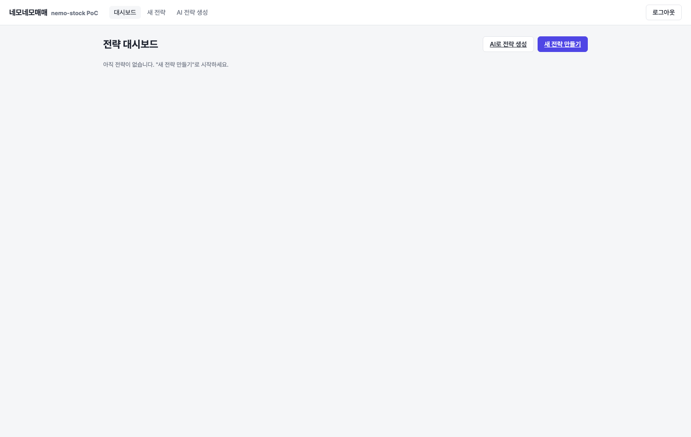

### 2. 노드 추가 — 파라미터가 캔버스 노드 안에 인라인으로 표시됨
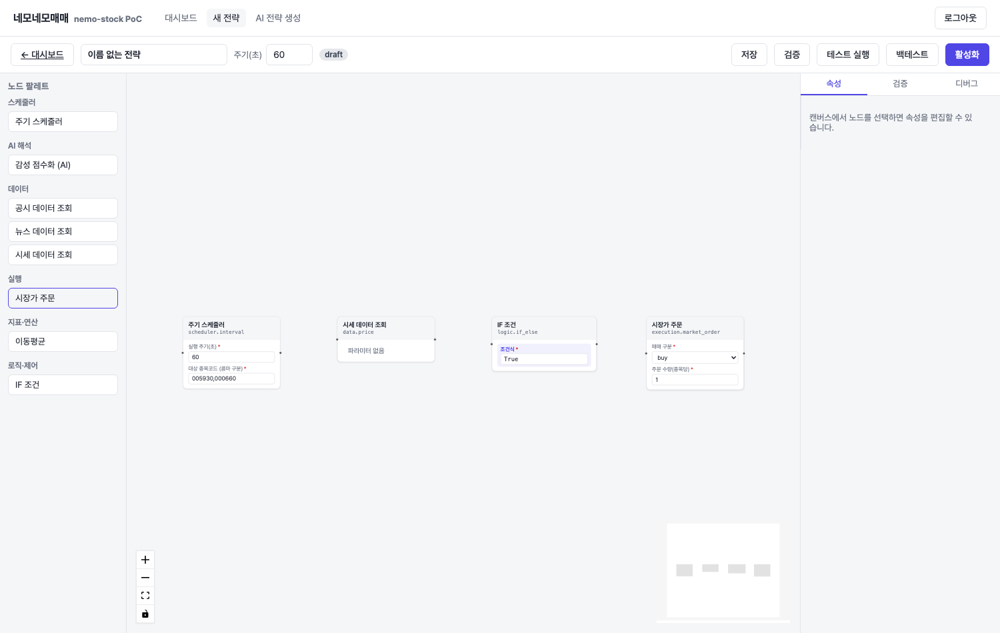

### 3. IF 조건식이 그래프에서 직접 보이고 편집됨
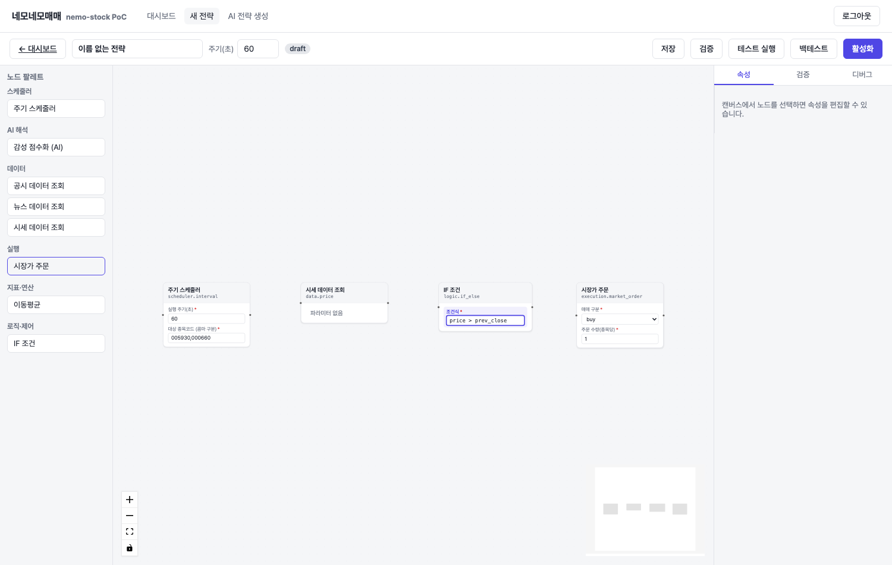

### 4. 4개 노드 연결 완료(엣지 3/3)
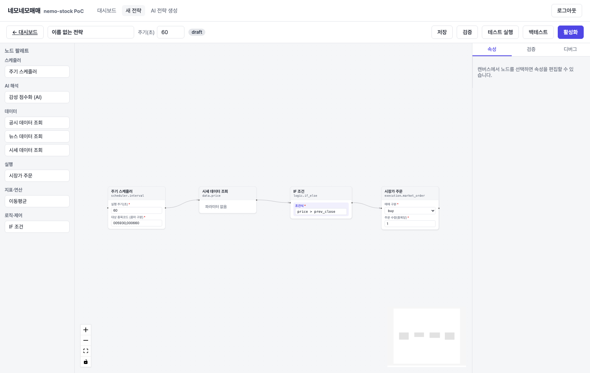

### 5. 속성 패널 — 코드(JSON) 편집 모드
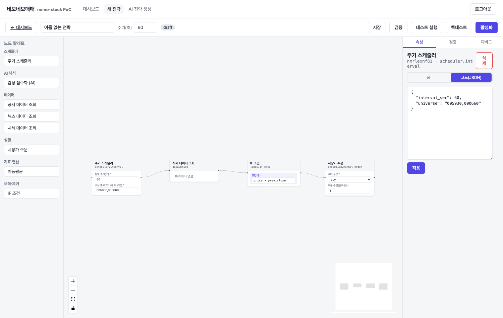

### 6. 그래프 검증 성공
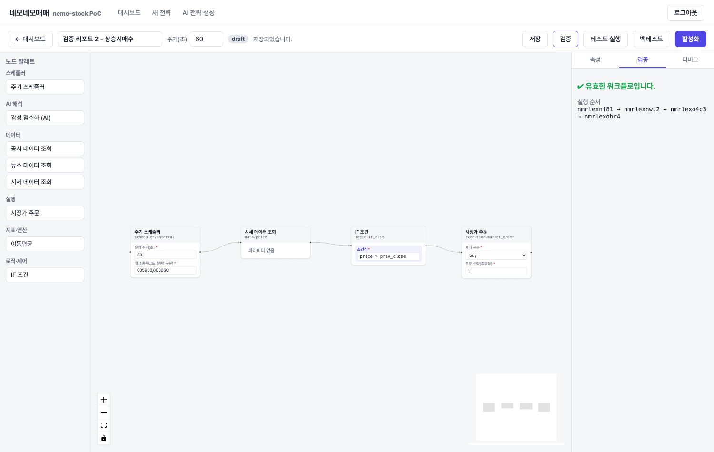

### 7~8. 테스트 실행 디버그 하이라이트(진행 중 → 완료)
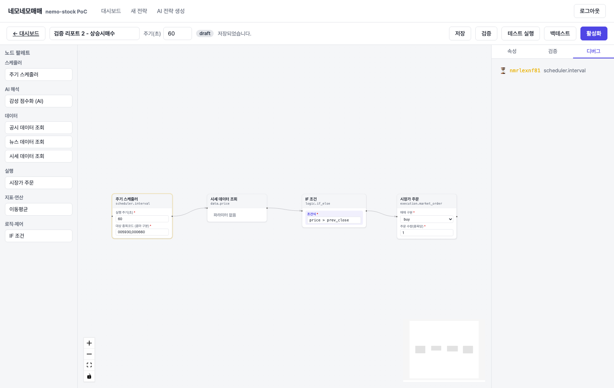
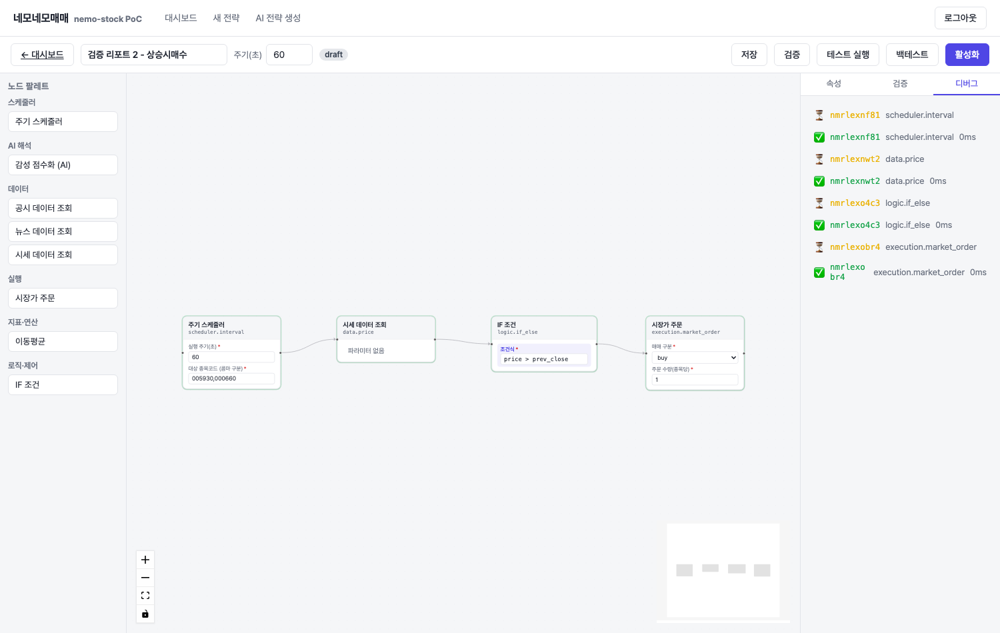

### 9~10. AI 전략 생성 — 실제 OpenAI 키로 6노드 다이아몬드형 워크플로 생성 → 캔버스 반영
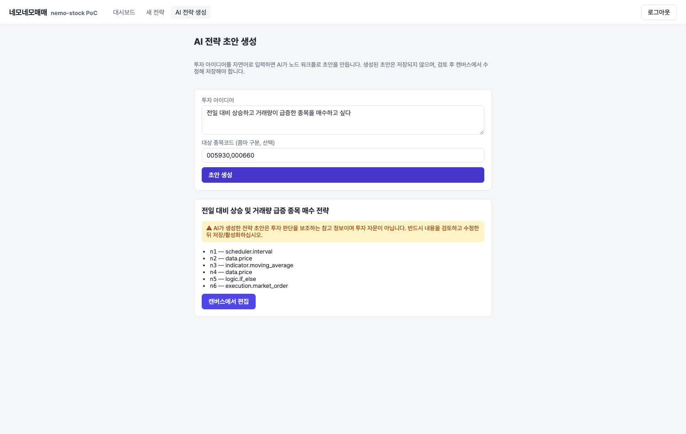
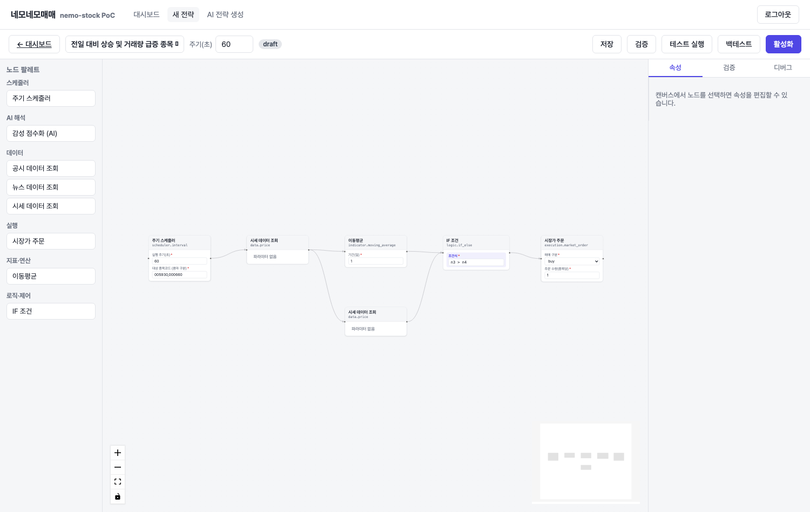

### 11. 삼성전자+SK하이닉스 실데이터 백테스트 결과(자산곡선)
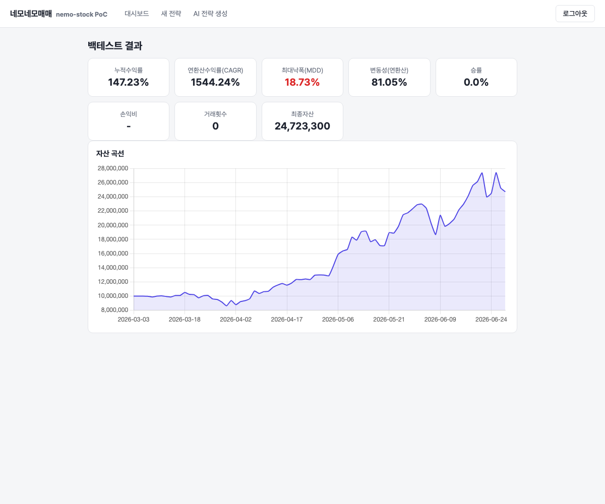

## 참고

- KOSCOM CHECK-API 조사 원본: `../../koscom-api/README.md`, `../../koscom-api/raw-*.txt`
- 이전 보고서: `../2026-07-14-golden-path/report.md`
- 이번에 실제로 검증된 것: 노드 인라인 편집 UI, AI 실키 생성, OpenDART 실키 수집, 공공데이터포털
  실키 수집(버그 수정 후), 실데이터 백테스트. **검증하지 못한 것**: KOSCOM CHECK-API 실제 호출
  (자격증명 없음), Toss증권 실제 호출(자격증명 없음).
